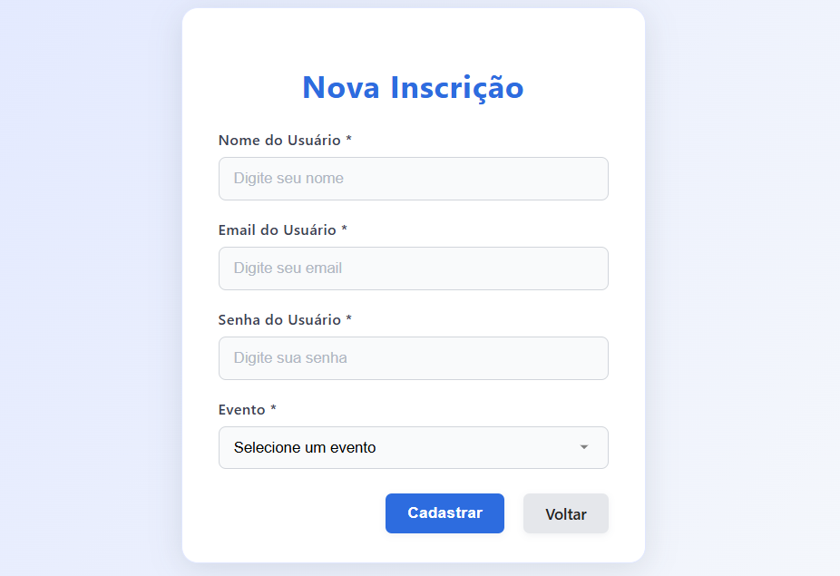
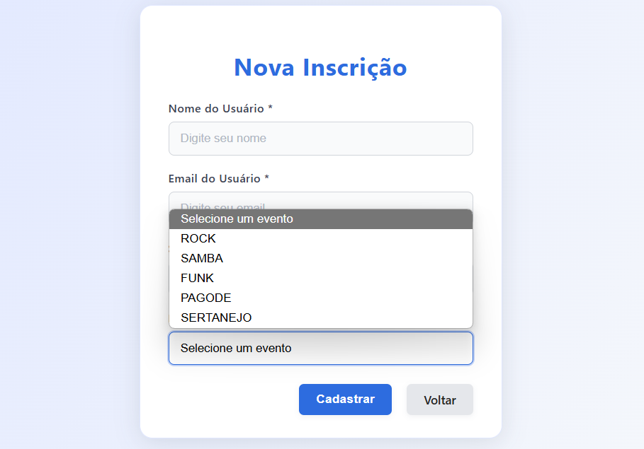

# Plataforma de Eventos — Projeto Individual (Módulo 2)

Este é um sistema web completo desenvolvido com **Node.js**, **Express.js**, **EJS**, **PostgreSQL** e **CSS**, que permite o **gerenciamento de eventos, usuários e inscrições**.  
O objetivo é oferecer uma **plataforma funcional** com **interface interativa**, conectada ao backend e banco de dados, simulando um sistema real de gestão de eventos (workshops, palestras, etc).

## 📁 Estrutura de Pastas

```
plataforma-eventos/
├── assets/
│   ├── arquitetura.jpeg
│   └── banco-relacional.png
├── documentos/
├── node_modules/
├── src/
│   ├── config/
│   │    └── db.js
│   ├── controllers/
│   │    └── EventController.js
│   │    └── SubscriptionController.js
│   │    └── UserController.js
│   ├── migration/
│   │    └── 202505201029.sql
│   │    └── runSQLscript.js
│   ├── models/
│   │    └── EventModel.js
│   │    └── SubscriptionModel.js
│   │    └── UserModel.js
│   ├── repositories/
│   │    └── EventRepository.js
│   │    └── SubscriptionRepository.js
│   │    └── UserRepository.js
│   ├── services/
│   │    └── EventService.js
│   │    └── SubscriptionService.js
│   │    └── UserService.js
│   ├── routes/
│   │    └── index.js
│   └── views/
│   │     └── inscricoes
│   │     │    └── index.ejs
│   │     └── usuarios
│   │          └── index.ejs
│   └── server.js
├── .env
├── .env.example
├── .gitignore
├── index.html
├── package-lock.json
├── package.json
├── readme.md
└── wad.md
```

## Como executar o projeto localmente

**1. Instale as dependências**

npm install

- bcrypt
- body-parser
- cors
- dotenv
- ejs
- express
- joi
- method-override
- pg

**2. Configure as variáveis de ambiente**

Crie um arquivo .env na raiz do projeto com os dados de conexão com o banco:

```
DB_USER="postgres.xxkarnrbvpgcxfhhlwcx"
DB_HOST="aws-0-us-east-2.pooler.supabase.com"
DB_DATABASE="postgres"
DB_PASSWORD="yGoBuSNEMLC9WWnB"
DB_PORT="6543"
DB_SSL="true"
```

**3. Inicie o servidor**

- node src/server.js

**4. Acesse no navegador**

- http://localhost:3000

## 🌐 Rotas da API

**Usuários**

- GET /api/users

- POST /api/users

- PUT /api/users/:id

- DELETE /api/users/:id

**Eventos**

- GET /api/events

- POST /api/events

- PUT /api/events/:id

- DELETE /api/events/:id

**Inscrições**

- GET /api/subscriptions

- POST /api/subscriptions

- PUT /api/subscriptions/:id

- DELETE /api/subscriptions/:id

## 💻 Views Desenvolvidas (/src/views/)

- **form.ejs: Página inicial/Formulário**

- **index.ejs: Lista com os usuários cadastrados**

As views usam EJS e estão conectadas ao banco via controllers e rotas Express, com res.render(...).

## 🎨 Estilização (CSS)

- Layout responsivo e organizado

- Feedback visual em botões e formulários

- Utilização de Flexbox e Grid

- Cores e fontes consistentes com acessibilidade

## 🧱 Tecnologias Utilizadas

- Node.js

- Express.js

- EJS

- PostgreSQL

- JavaScript (Fetch API)

- CSS

- Dotenv

- Arquitetura MVC

## 🗃️ Banco de Dados

**Entidades:**

- users — Usuários do sistema

- events — Eventos disponíveis

- subscriptions — Inscrições em eventos

**Modelo físico (SQL):**

- ./src/migration/202505201029.sql

**Modelo relacional (visual):**

assets/banco-relacional.png

## 🖼️**Interface**

### **- Página Principal / Formulário**

Tela de início do sistema com formulário completo para cadastrar uma nova inscrição no sistema. Os campos obrigatórios incluem: Nome do Usuário, Email, Senha e Tipo de Evento. Abaixo do formulário, há dois botões: Cadastrar, que envia os dados, e Voltar, que retorna para a tela de listagem.



### **- Formulário**

Formulário parcial de nova inscrição, onde o usuário deve preencher o nome, email e escolher o tipo de evento em uma lista suspensa. A lista inclui opções como ROCK, SAMBA, FUNK, etc. Esta interface antecipa a seleção antes da submissão completa do cadastro.



## **🎥 Vídeo de Demonstração**

[Clique aqui para assistir ao vídeo de demonstração](https://drive.google.com/file/d/1yo3gLndQphmrcAlHZjg9uLDdoRJ76pNz/view?usp=sharing)

## 📄 Licença

**Este projeto é acadêmico, desenvolvido no Instituto de Tecnologia e Liderança (Inteli), como parte da disciplina de Computação (Módulo 2)**
