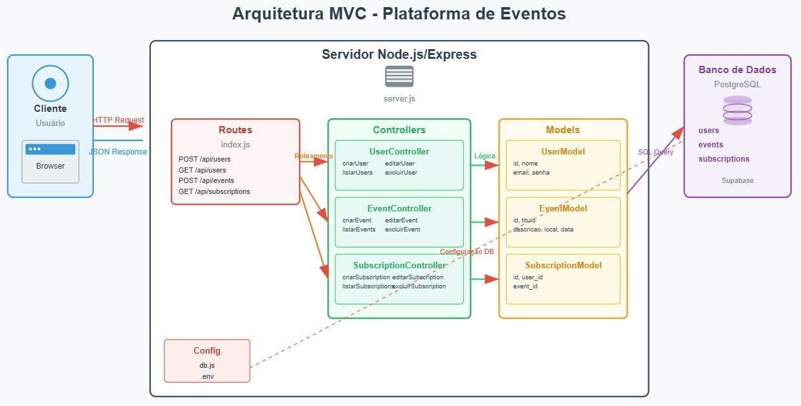
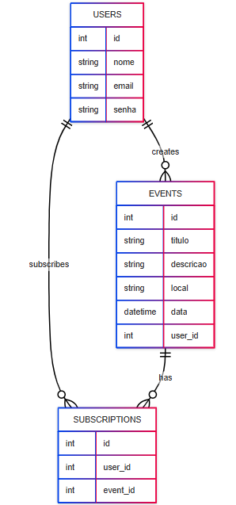

# Web Application Document (WAD)

## Introdução

Este sistema é uma plataforma para criação e inscrição em eventos, com autenticação de usuários.

## Arquitetura MVC

O sistema segue o padrão arquitetural Model-View-Controller (MVC), proporcionando uma separação clara de responsabilidades e facilitando a manutenção e escalabilidade da aplicação.

### Fluxo de Dados

1. **Cliente → Servidor**: O usuário faz requisições HTTP através do browser
2. **Routes → Controllers**: O sistema de roteamento direciona as requisições para os controllers apropriados
3. **Controllers → Models**: Os controllers executam a lógica de negócio e chamam os models
4. **Models → Banco de Dados**: Os models executam queries SQL no PostgreSQL
5. **Resposta**: Os dados retornam como JSON response ao cliente

### Componentes da Arquitetura

#### Routes (Roteamento)

- **Arquivo**: `src/routes/index.js`
- **Responsabilidade**: Definir endpoints da API e mapear para controllers
- **Rotas principais**:
- `POST/GET/PUT/DELETE /api/users`
- `POST/GET/PUT/DELETE /api/events`
- `POST/GET/PUT/DELETE /api/subscriptions`

#### Controllers (Controladores)

- **Localização**: `src/controllers/`
- **Responsabilidade**: Processar requisições, executar lógica de negócio e retornar respostas

**UserController.js**

- `criarUser()` - Criar novo usuário
- `listarUsers()` - Listar todos os usuários
- `editarUser()` - Editar usuário existente
- `excluirUser()` - Excluir usuário

**EventController.js**

- `criarEvent()` - Criar novo evento
- `listarEvents()` - Listar todos os eventos
- `editarEvent()` - Editar evento existente
- `excluirEvent()` - Excluir evento

**SubscriptionController.js**

- `criarSubscription()` - Criar nova inscrição
- `listarSubscriptions()` - Listar todas as inscrições
- `editarSubscription()` - Editar inscrição existente
- `excluirSubscription()` - Excluir inscrição

#### Models (Modelos)

- **Localização**: `src/models/`
- **Responsabilidade**: Interagir com o banco de dados e definir estrutura dos dados

**UserModel.js**

- Campos: `id`, `nome`, `email`, `senha`
- Operações CRUD para tabela `users`

**EventModel.js**

- Campos: `id`, `titulo`, `descricao`, `local`, `data`, `user_id`
- Operações CRUD para tabela `events`

**SubscriptionModel.js**

- Campos: `id`, `user_id`, `event_id`
- Operações CRUD para tabela `subscriptions`

#### Configuração

- **db.js**: Configuração da conexão com PostgreSQL
- **.env**: Variáveis de ambiente (credenciais do banco)

## Diagrama do Banco de Dados

## Tecnologias Utilizadas

- **Backend**: Node.js + Express.js
- **Banco de Dados**: PostgreSQL (Supabase)
- **Padrão Arquitetural**: MVC (Model-View-Controller)
- **Outras dependências**: pg, dotenv, cors
